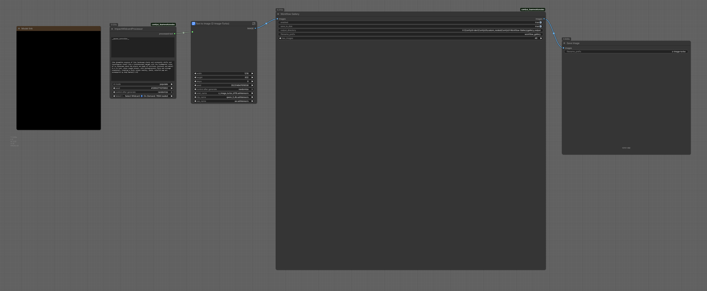

# ComfyUI-Workflow-Gallery

Workflow Gallery is a custom ComfyUI node that collects images passing through it and displays them inside a scrollable gallery directly on the node.

## Version

Current release: **v0.1.10**

## Features

- Receives image batches
- Saves images to a chosen directory
- Shows thumbnails inside the node UI
- Lets you clear the gallery
- Lets you resize thumbnails with a slider
- Click a thumbnail to open it in viewer mode
- Click the expanded image to return to the gallery
- Use on-screen left and right arrows to move through images in viewer mode
- Passes the input images through unchanged
- Automatically prunes oldest images when the gallery reaches the configured limit

## Why I made this

I wanted a cleaner way to review multiple generated images inside a workflow without digging through output folders every time.

A practical use case is generating multiple showcase images for wildcard packs, LoRAs, prompt packs, or Civitai posts. Instead of hunting through saved files, this node lets you review results directly inside ComfyUI.

## Screenshots

### Workflow Example


### Gallery View


### Viewer Mode


## Installation

1. Copy this folder into `ComfyUI/custom_nodes/`
2. Restart ComfyUI
3. Search for **Workflow Gallery** in the node menu under `image/ui`

Example:

```text
ComfyUI/
└── custom_nodes/
    └── ComfyUI-Workflow-Gallery/